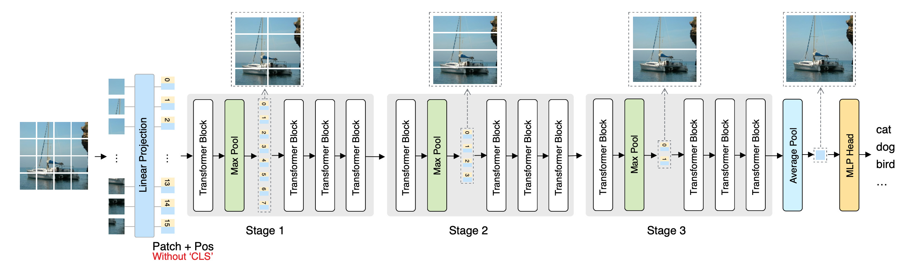

# Scalable Vision Transformers with Hierarchical Pooling

This is the official PyTorch implementation of  ICCV 2021 paper: **Scalable Vision Transformers with Hierarchical Pooling**.

By [Zizheng Pan](https://scholar.google.com.au/citations?user=w_VMopoAAAAJ&hl=en), [Bohan Zhuang](https://sites.google.com/view/bohanzhuang), [Jing Liu](https://sites.google.com/view/jing-liu/首页), [Haoyu He](https://scholar.google.com/citations?user=aU1zMhUAAAAJ&hl=en), and [Jianfei Cai](https://scholar.google.com/citations?user=N6czCoUAAAAJ&hl=en).



In our [paper](https://arxiv.org/abs/2103.10619), we propose a Hierarchical Visual Transformer (HVT) which progressively pools visual tokens to shrink the sequence length and hence reduces the computational cost, analogous to the feature maps downsampling in Convolutional Neural Networks (CNNs). Moreover, we empirically find that the average pooled visual tokens contain more discriminative information than the single class token. 


If you use this code for a paper please cite:

```
@article{pan2021scalable,
  title={Scalable vision transformers with hierarchical pooling},
  author={Pan, Zizheng and Zhuang, Bohan and Liu, Jing and He, Haoyu and Cai, Jianfei},
  journal={arXiv preprint arXiv:2103.10619},
  year={2021}
}
```


# Usage

First, clone the repository locally:
```
git clone https://github.com/MonashAI/HVT
```
Then, install PyTorch 1.7.0+ and torchvision 0.8.1+ and [pytorch-image-models 0.3.2](https://github.com/rwightman/pytorch-image-models):

```
conda install -c pytorch pytorch torchvision
pip install timm==0.3.2
```


## Data preparation

### ImageNet

Download the ImageNet 2012 dataset from [here](http://image-net.org/), and prepare the dataset based on this [script](https://gist.github.com/BIGBALLON/8a71d225eff18d88e469e6ea9b39cef4). The file structure should look like:

```
imagenet
├── train
│   ├── class1
│   │   ├── img1.jpeg
│   │   ├── img2.jpeg
│   │   └── ...
│   ├── class2
│   │   ├── img3.jpeg
│   │   └── ...
│   └── ...
└── val
    ├── class1
    │   ├── img4.jpeg
    │   ├── img5.jpeg
    │   └── ...
    ├── class2
    │   ├── img6.jpeg
    │   └── ...
    └── ...
```

### CIFAR100

Download the CIFAR100 dataset from [here](https://www.cs.toronto.edu/~kriz/cifar-100-python.tar.gz).


## Training
To train HVT-Ti-1 on ImageNet with 8 gpus, run:

```bash
python -m torch.distributed.launch --nproc_per_node=8 --use_env main.py --config config/hvt-ti-1.json --data-set IMNET --data-path [path/to/imagenet]
```

We also provide configuration files for HVT-S-1 and Scale HVT-Ti-4 under  the `config` folder.

To train HVT-Ti-1 on CIFAR100, run:

```bash
python -m torch.distributed.launch --nproc_per_node=8 --use_env main.py --config config/hvt-ti-1.json --data-set CIFAR --data-path [path/to/cifar100]
```


## Scaling HVT

You can scale a HVT model with various settings, which is supported in the configuration file:

- `input_size`: The input image size.
- `patch_size`: The patch size that used to split an image.
- `num_heads`: The number of self-attention heads in a MSA layer.
- `num_blocks`: The number of Transformer blocks in a model.
- `pool_kernel_size`: The kernel size of the pooling layer.
- `pool_stride`: The stride of the pooling layer.
- `pool_block_width`:  The number of blocks for each stage.


## Results on ImageNet

### Main Results

| Name           | FLOPs (G) | Params (M) | Top-1 Acc. (%) | Top-5 Acc. (%) |
| -------------- | --------- | ---------- | -------------- | -------------- |
| HVT-Ti-1       | 0.64      | 5.74       | 69.64          | 89.40          |
| Scale HVT-Ti-4 | 1.39      | 22.12      | 75.23          | 92.30          |
| HVT-S-1        | 2.40      | 22.09      | 78.00          | 93.83          |

### More Pooling Stages with HVT-S

| Name    | FLOPs (G) | Params (M) | Top-1 Acc. (%) | Top-5 Acc. (%) |
| ------- | --------- | ---------- | -------------- | -------------- |
| HVT-S-0 | 4.57      | 22.05      | 80.39          | 95.13          |
| HVT-S-1 | 2.40      | 22.09      | 78.00          | 93.83          |
| HVT-S-2 | 1.94      | 22.11      | 77.36          | 93.55          |
| HVT-S-3 | 1.62      | 22.11      | 76.32          | 92.90          |
| HVT-S-4 | 1.39      | 22.12      | 75.23          | 92.30          |

For CIFAR-100 results, please check out our [paper](https://arxiv.org/abs/2103.10619) for more details.


# License

This repository is released under the Apache 2.0 license as found in the [LICENSE](LICENSE) file.


## Acknowledgement

This repository has adopted codes from [DeiT](https://github.com/facebookresearch/deit), we thank the authors for their open-sourced code.


